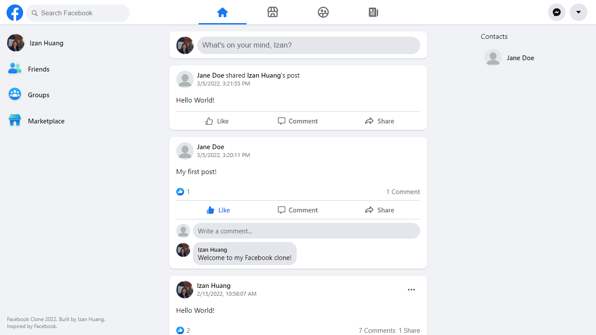

# Facebook Clone

> [Facebook clone](https://facebook-clone-53d9e.firebaseapp.com/) built with React and Firebase.

## 📚 Core Packages

1. firebase - authentication, store and query data, image uploading, hosting
2. styled-components - styling
3. react-router-dom - routing

## 🔧 Features

- Login / Signup
- New Post
- Like
- Comment
- Share
- Edit Profile
- View Profile
- Search & Add Users
- Dark / Light Theme

## 🚀 Setup

- To run this project, clone it using git and install it locally using npm:

```
git clone https://github.com/izanhuang/facebook-clone.git
cd facebook-clone
npm install
npm start
```

- Create a `.env` file similar to `.env.example` with the appropriate keys.

- Your site is now running at http://localhost:3000!

## 🖥️ Web Preview

<p align="center"><b>Home</b></p>



<p align="center"><b>New Post</b></p>


<p align="center"><b>Edit Profile</b></p>


<p align="center"><b>View Profile</b></p>


<p align="center"><b>Settings</b></p>


## 📱 Mobile Preview

<p align="center"><b>Mobile Home, Search, and Add Friend</b></p>

<p float="left">
  
   
   
</p>

## 📧 Contact

Created by [@izanhuang](https://www.linkedin.com/in/izanhuang/) - feel free to contact me!
Happy coding 🎉🙌
